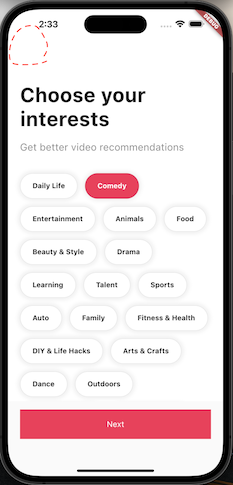
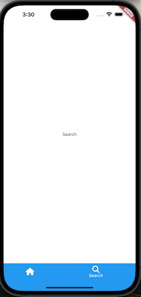
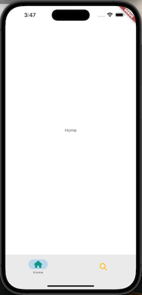

# tiktok_clone

tiktok clone lecture

## Previous Chapters
[3. PROJECT SETUP](https://github.com/yuriyaya/tiktok_clone/tree/ch3)

[4. AUTHENTICATION](https://github.com/yuriyaya/tiktok_clone/tree/ch4)

[5. ONBOARDING](https://github.com/yuriyaya/tiktok_clone/tree/ch5)
## Tab Navigation
### 1. pushAndRemoveUntil

### 2. BottomNavigationBar

### 3. NavigationBar
