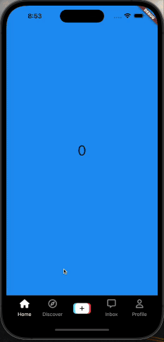
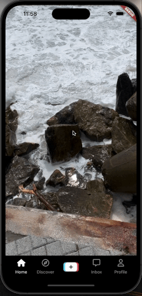
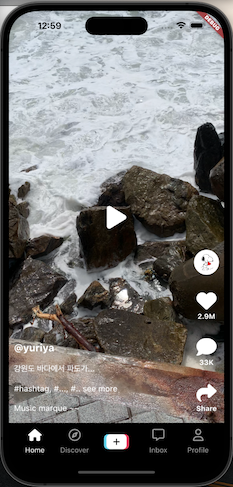

# tiktok_clone

tiktok clone lecture

## Previous Chapters
[3. PROJECT SETUP](https://github.com/yuriyaya/tiktok_clone/tree/ch3)

[4. AUTHENTICATION](https://github.com/yuriyaya/tiktok_clone/tree/ch4)

[5. ONBOARDING](https://github.com/yuriyaya/tiktok_clone/tree/ch5)

[6. Tab Navigation](https://github.com/yuriyaya/tiktok_clone/tree/ch6)
## Video Timeline
### 1. Infinite Scrolling

* PageView
* PageView.builder
### 2. PageViewController

* PageViewController
### 3. Video Player

* pub.dev: video_player
  * how to play video, how to detect end of video
  * send function to anoter widget, use that function inside of stateful widget
* define assets in pubspec.yaml
* Stack / Positioned.fill
### 4. Visibility Detector

* pub.dev: visibility_detector
  * detect widget visible completely. prohibit video play during page transition
* Stack / Positioned.fill / IgnorePointer
### 5. Animation Controller

* AnimationController / Transform.scale
### 6. Animation Builder
result same as before :)
* AnimationBuilder
### 7. SingleTickerProviderStateMixin
result same as before :)
* SingleTickerProviderStateMixin
### 8. Video UI

* Positioned / CircleAvatar