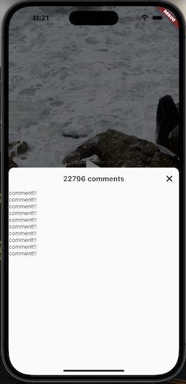

# tiktok_clone

tiktok clone lecture

## Previous Chapters
[3. PROJECT SETUP](https://github.com/yuriyaya/tiktok_clone/tree/ch3)

[4. AUTHENTICATION](https://github.com/yuriyaya/tiktok_clone/tree/ch4)

[5. ONBOARDING](https://github.com/yuriyaya/tiktok_clone/tree/ch5)

[6. Tab Navigation](https://github.com/yuriyaya/tiktok_clone/tree/ch6)

[7. Video Timelien](https://github.com/yuriyaya/tiktok_clone/tree/ch7)
## Comments Section
### 1. showModalBottomSheet

* showModalBottomSheet
