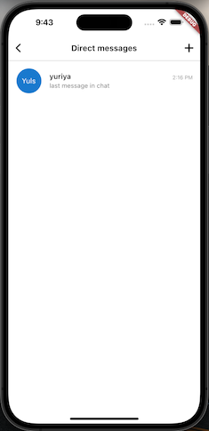
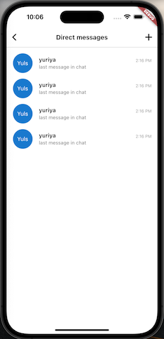
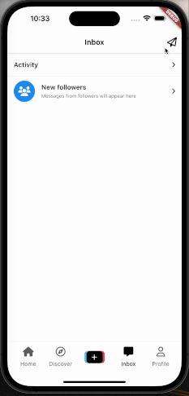

# tiktok_clone

tiktok clone lecture

## Previous Chapters
[3. PROJECT SETUP](https://github.com/yuriyaya/tiktok_clone/tree/ch3)

[4. AUTHENTICATION](https://github.com/yuriyaya/tiktok_clone/tree/ch4)

[5. ONBOARDING](https://github.com/yuriyaya/tiktok_clone/tree/ch5)

[6. Tab Navigation](https://github.com/yuriyaya/tiktok_clone/tree/ch6)

[7. Video Timeline](https://github.com/yuriyaya/tiktok_clone/tree/ch7)

[8. Comments Section](https://github.com/yuriyaya/tiktok_clone/tree/ch8)

[9. Discover](https://github.com/yuriyaya/tiktok_clone/tree/ch9)

[10. Inbox](https://github.com/yuriyaya/tiktok_clone/tree/ch10)
## Chats
### 1. Direct Messages

* ListTile

### 2. AnimatedList

* AnimatedList
* AnimatedList - FadeTransition/SizeTransition

### 3. AnimatedList part2

* AnimatedList
